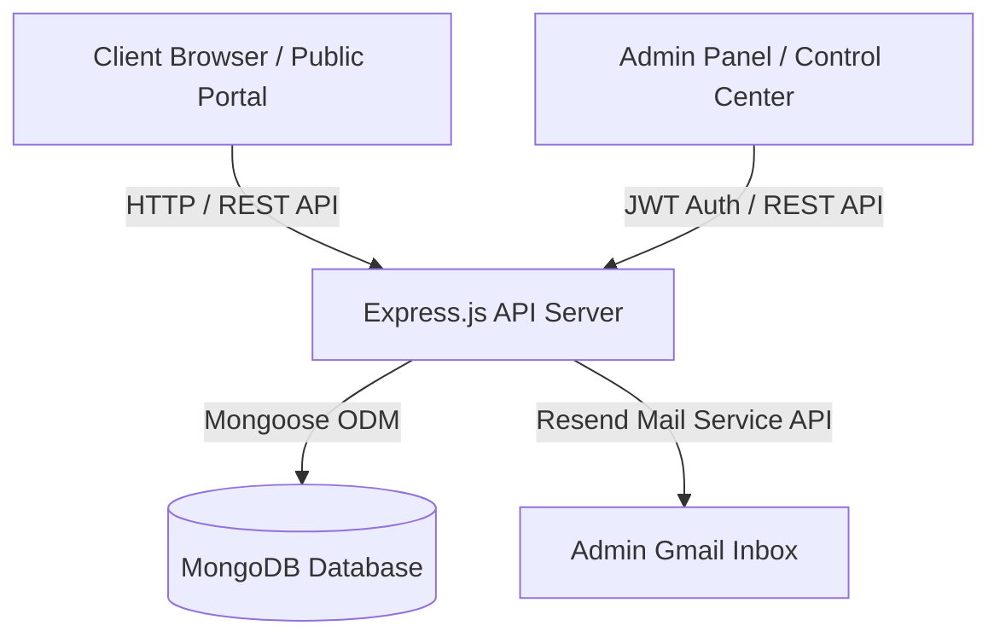

# 🚀 Stackline Studio — Digital Agency Web Application & Admin CMS

A state-of-the-art, full-stack digital agency web application and content management system (CMS) engineered with **React (Vite)**, **TailwindCSS**, **Node.js**, **Express.js**, and **MongoDB**.

---

## 📋 Executive Overview

**Stackline Studio** is a full-featured web application designed for a modern creative design & engineering agency. It combines a high-impact, visual public client portal with a secure, real-time administrative management panel. 

The application facilitates seamless client lead generation, portfolio showcase presentation, dynamic service management, team profiling, client testimonial publishing, and editorial journal articles.

---

## 🏗️ System Architecture & Technology Stack



### **Frontend Stack**
* **Framework:** React 18 with Vite HMR
* **Routing:** React Router v6
* **Styling:** Custom CSS Design System + TailwindCSS
* **UI Components:** Lucide Icons, Custom Micro-Animations, Glassmorphism Cards
* **State & Auth:** React Context API + LocalStorage JWT token management

### **Backend Stack**
* **Runtime:** Node.js (v18+)
* **Web Framework:** Express.js (v5)
* **Database:** MongoDB with Mongoose ODM
* **Authentication:** JSON Web Tokens (JWT) + BcryptJS password hashing
* **Email Service:** Resend Mail Service API (`https://api.resend.com/emails`)
* **Security & Utility:** Helmet, CORS, Morgan Logger, Multer file upload

---

## 🚀 Key Features & Functional Modules

### **1. Public Client Portal**
* **Hero Slider & Landing Showcase:** Interactive dynamic hero banner showcasing agency perceptions and high-resolution SVG showcases.
* **Portfolio Showcase (`/work` & `/work/:slug`):** Interactive project gallery with uncropped image presentation and detailed case study pages.
* **Service Offerings (`/service`):** Service breakdown cards and interactive step-by-step agency methodology.
* **Studio Narrative & Team (`/about`):** Agency story, core pillars, team member profiles, and approved client reviews.
* **Journal & Insights (`/blog` & `/blog/:slug`):** Editorial journal articles with category filtering and article detail reader views.
* **Interactive Contact Form (`/talk`):** Multi-step service request form with real-time MongoDB recording and automated admin email dispatching.

### **2. Admin Control Panel (`/admin`)**
* **System Dashboard:** System metrics, quick actions, lead activity statistics, and server status monitors.
* **Inquiries & Lead Inbox:** Form submission management, status tracking (`new`, `read`, `replied`, `archived`), 12-hour formatted timestamps, and one-click email reply triggers.
* **Portfolio CMS:** Create, edit, and manage client project case studies, metadata, hero covers, and image galleries.
* **Services CMS:** Dynamic service creation, positioning, and content editing.
* **Client Reviews CMS:** Manage and approve public client testimonials.
* **Journal / Article CMS:** Create and publish blog insights with image assets and categories.
* **Security & Protected Routes:** Role-based access control preventing unauthorized route navigation.

---

## ⚡ Quickstart & Installation Guide

### **1. Environment Configuration**

Create a `.env` file in the `/server` directory:

```env
PORT=5000
MONGO_URI=mongodb://127.0.0.1:27017/kajo_studio
JWT_SECRET=stackline_admin_secret_key_2026
ADMIN_ALERT_EMAIL=rababzahra425@gmail.com
ADMIN_PASSWORD=admin123
```

---

### **2. Backend Setup**

```bash
cd server
npm install
npm run seed  # Optional: Seed superadmin credentials manually
npm run dev   # Starts server at http://localhost:5000
```


### **3. Frontend Setup**

```bash
cd frontend
npm install
npm run dev   # Starts Vite React App at http://localhost:5173
```

---

## 📄 License & Attribution

Designed and developed for **Stackline Studio**. All rights reserved © 2026.
